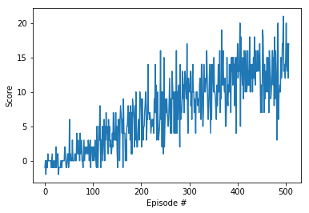

# Summary

This is first implementation of my DRL agent for banana collection problem. The implemetation is in _Navigation.ipynb_ file (Jupyter Notebook)

## The problem

The environment is a continous limited 2D space. In the space there is an agent and number of purple and yellow bananas. The agent can move in the environment, by stepping over a banana the agent collects it. The goal of the algoritm is to effectively collect yellow bananas while not picking purple ones.

The agent has four actions available: go forward, go backward, turn left, turn right.

## Learning Algorithm

For the first iteration I have used most vanila DRL agent that I have learned in the course. I have done it to verify that fundamentals of my work are correct before going into more advanced techniques.

The neural network responsible for the agent's behaviour has three layers of neurons: two hidden layers and one output layer. Both hidden layers have 64 units, the output layer has number of units equal to number of possible actions. The activation function for the hidden layers is ReLU, as it is a safe default for NN modeling non-linear models.

## Rewards

The target value of the mean reward per 100 episodes window, equal to 13.0, has been reached in 407 episodes.

## Ideas for Further Work

As mentioned in the beginning, my aim is to verify my approach before going deeper into enhancing the algorithm. I would like to try dueling DQN, as well as test different NN architecture for this particular problem.